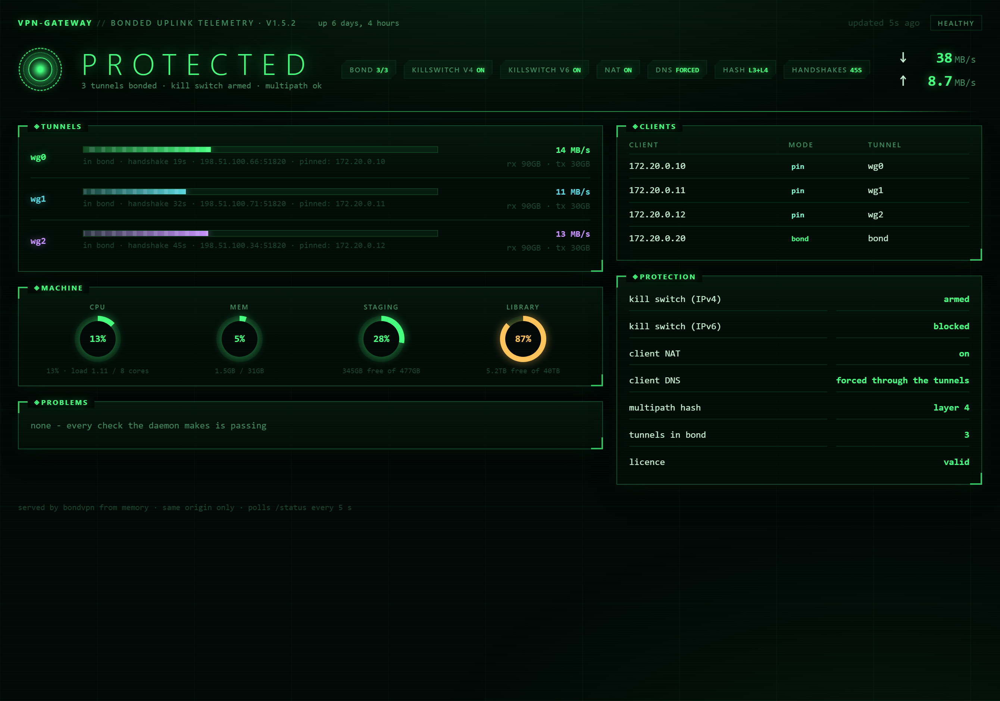

# BondVPN

Multi-tunnel WireGuard routing for a download stack. One static binary, no
runtime dependencies, fails closed.

Point your \*arr containers at it and each one gets a VPN exit that behaves the
way that application actually wants:

- **Pinned clients** get one tunnel each and stay on it. BitTorrent ties your
  identity to an address, so spreading a torrent client across tunnels leaves
  trackers and peers holding an address you are not reliably at. Measured
  against the same swarms: 1 connected seed at 0 B/s spread, against 7 seeds at
  2.05 MB/s pinned.
- **Bonded clients** are spread across every live tunnel. Usenet, indexers and
  direct HTTP open many independent connections to one server, each
  authenticating separately, so a rotating source address costs nothing and you
  get the sum of your tunnels.
- **Nothing leaks.** With every tunnel down, clients have no path out at all —
  and `bondvpn leak-test` proves it by measuring, not by asserting.

Free to use. Ships configured for three tunnels; up to five are supported.

**New here?** [SETUP.md](SETUP.md) walks the whole thing end to end — a bare
Linux box to Sonarr, Radarr, Prowlarr, sabnzbd and three qBittorrents, each
leaving through the exit you chose for it. It includes deploying the arr stack
if you don't already have one.



*The interface BondVPN serves, on a gateway with three tunnels bonded. Every
figure in this shot is invented and every address comes from the documentation
ranges — it is the real page, not a mockup, rendered against a fixture.*

## The interface

`bondvpn run` serves a page at the root of `listen` — the same address as the
API, so with the default `listen: 127.0.0.1:8099` it is at
<http://127.0.0.1:8099/> on the gateway itself.

It shows the hero state (**protected**, **degraded**, **blocked** or
**exposed**), every tunnel with its handshake age, endpoint, pinned clients and
live throughput, the per-client routing table, every protection the daemon
maintains, the problem list, and a machine panel with CPU, memory and whichever
filesystems you name:

```yaml
dashboard: true          # false serves /status and /healthz alone

disks:
  - staging /data
  - library /mnt/library
```

Three things worth knowing:

- **It is one file compiled into the binary and fetches nothing external.** A
  gateway whose kill switch is doing its job has no route out, so a page that
  pulled a font or a script from a CDN would break at exactly the moment you
  opened it to find out what broke.
- **It shows only what `/status` carries**, so no panel can quietly invent a
  number. Torrent queues, imports and service tiles are not in it — those belong
  to your download stack, not to a VPN router, and BondVPN holds no credentials
  for them.
- **There is no login.** It is a read-only view of one machine's own routing,
  reachable from that machine or its container network. Moving `listen` to a LAN
  address publishes it to your whole network — put a reverse proxy with a login
  in front of it if that is what you want.

## Install

Download the binary for your architecture from
[Releases](https://github.com/wonderingStars/bondvpn/releases), then:

```
sudo install -m 0755 bondvpn-linux-amd64 /usr/local/bin/bondvpn
sudo install -d /etc/bondvpn
sudo install -m 0600 config.example.yml /etc/bondvpn/config.yml
sudo install -m 0644 bondvpn.service /etc/systemd/system/
sudoedit /etc/bondvpn/config.yml
sudo systemctl enable --now bondvpn
```

Or run `sudo ./install.sh` from the directory holding the downloaded binary — it
does the same thing, picks the right architecture, and will not overwrite a
config you already have.

Verify what you downloaded against `SHA256SUMS` on the release:

```
sha256sum -c SHA256SUMS
```

Requires Linux, root, and `wg`, `wg-quick`, `ip`, `iptables`, `curl`.

### Your tunnel configs

A provider's file as downloaded is not safe to hand to this gateway. BondVPN
checks each one at startup and refuses to run rather than misbehave quietly, so
you find out immediately rather than a week later:

```ini
[Interface]
Table = off                 # REQUIRED. Otherwise wg-quick installs its own
                            # default route and fights BondVPN for the routing
                            # table — your traffic takes the wrong tunnel and
                            # nothing reports an error.
# DNS = 10.64.0.1           # REMOVE this line. wg-quick uses it to rewrite
                            # your machine's own resolver, and fails outright
                            # if resolvconf is not installed. BondVPN handles
                            # client DNS itself.
[Peer]
PersistentKeepalive = 25    # Recommended. WireGuard only rekeys when there is
                            # traffic, so an idle tunnel stops handshaking and
                            # gets dropped from the bond while perfectly
                            # healthy. This warns rather than refuses.
```

## Configure

Everything is documented in `config.example.yml`. The two settings that matter:

```yaml
clients: 172.20.0.0/24     # the network your containers sit on

routes:
  pin:                     # torrent clients: one tunnel each, permanently
    - 172.20.0.10
  bond:                    # usenet, indexers, direct HTTP: spread across all
    - 172.20.0.20
```

`clients` must be your containers' own network, never your LAN. BondVPN refuses
to start if you point it at your LAN, because that configuration routes the
host's own replies into a tunnel and the machine goes silent while looking
perfectly healthy.

### DNS is enforced, not suggested

`dns:` is required, and every DNS query leaving your client subnet is rewritten
in the kernel to that resolver, over the tunnels — whatever the container itself
is set to use.

Merely allowing DNS is not enough: a container pointed at a public resolver
leaks every hostname you look up while its traffic stays correctly tunnelled and
nothing looks broken. Configuring it per-container would make your privacy
depend on never forgetting a line in a compose file. There is nothing here for
you to get wrong.

## Check before you start

```bash
sudo bondvpn check
```

It reads the config, every WireGuard file that config names, this machine's
interfaces, the listen address and the disks, and prints **everything** it finds
in one pass. It changes nothing — no rules, no routes, no interfaces brought up
— so it is safe on a box that is already carrying traffic.

```
bondvpn 1.5.1 - checking /etc/bondvpn/config.yml

configuration
  FAIL  line 6: disks want 'label /path'
  FAIL  no tunnels configured - at least one WireGuard config is required
  FAIL  dns is required - set your provider's resolver (Mullvad's is 10.64.0.1)

wireguard configs
  FAIL  cannot read /etc/wireguard/wg-oops.conf: no such file or directory

this machine
  ok    WAN interface eth0, LAN 192.168.1.0/24
  FAIL  refusing to start: clients subnet 192.168.1.0/24 contains this host's
        management address 192.168.1.6 - the host's own replies would be routed
        into a tunnel and the box would become unreachable

status api and interface
  ok    listen 127.0.0.1:8099 is loopback-only and the interface
```

Exit code is 1 if anything failed and 0 if only warnings remain, so it drops
into a provisioning script. Warnings are advice, not faults — an unreadable disk
or a missing `PersistentKeepalive` still lets the gateway route, and the summary
says so.

## Use

```
bondvpn run          # the daemon; what systemd starts
bondvpn status       # current state as JSON, exit 1 if anything is wrong
bondvpn leak-test    # disruptive proof that nothing escapes
bondvpn stop         # tunnels down AND the kill switch removed
```

`status` is read-only and safe at any time. `stop` is the only command that
disarms the kill switch — restarting or killing the daemon deliberately leaves
it armed, so there is never a window where your clients route straight out of
your ISP connection.

### Status API

`run` serves the same document over HTTP on `listen` (loopback by default):

- `GET /status` — the full JSON document
- `GET /healthz` — 200 when healthy, 503 with the reasons when not

It exposes tunnel endpoints and client addresses and has no authentication of
its own. Put a reverse proxy in front of it if you want it on your LAN.

```json
{
  "version": "1.2.0",
  "bonded": 3,
  "hash_policy": 1,
  "nat": true,
  "dns_forced": true,
  "killswitch": { "v4": true, "v6": true },
  "tunnels": [
    { "iface": "wg0", "up": true, "in_bond": true, "handshake_age": 44,
      "pinned_clients": ["172.20.0.10"] }
  ],
  "problems": []
}
```

### The leak test

`leak-test` drops every tunnel for around thirty seconds, then probes a
hostname, a raw IP and ICMP from a throwaway network namespace attached to your
container bridge — kernel-wise indistinguishable from one of your containers, so
it is matched by exactly the same firewall rules. Then it restores the tunnels
and verifies your pinned clients came back spread across them.

Probing from the host would prove nothing: the kill switch sits in a
forward-side chain and never sees host traffic, so a host can reach the internet
perfectly legitimately while every container is sealed.

## What it reports as a problem

`status` and `/healthz` name the silent failures, not just the loud ones:

- a tunnel that is up but has not handshaken — it will blackhole whatever is
  routed into it, and "up" means very little on WireGuard
- every pinned client landing on the same tunnel, which looks healthy because
  traffic still flows
- `fib_multipath_hash_policy` not set to 1, without which every connection to a
  given server lands on one tunnel and bonding does nothing
- the kill switch not being armed
- your traffic not being translated onto the tunnels, which nothing else
  reveals: the tunnels handshake, the routing is correct, the counters move,
  and every request dies at the far end with no error anywhere
- your DNS not being redirected
- a tunnel config that has lost `Table = off`, gained a `DNS =` line, or never
  had a keepalive

And whatever it can repair, it repairs:

- the kill switch, the address translation and the DNS redirect, if anything
  removes them — a firewall reload takes them out silently, and a kill switch
  failing open is exactly the case where nobody is watching
- the routing rules **and** the routes inside them. Deleting an interface
  silently empties the table that routed through it while the rule pointing at
  that table survives, so a tunnel that drops and returns would otherwise leave
  one client with no way out and everything else looking fine
- the tunnels themselves — a tunnel that goes down is started again, and one
  that is up but has stopped handshaking (which blackholes whatever is routed
  into it) is cycled. Without that, one blip leaves you permanently down a
  tunnel while everything reports itself healthy.

## Why three tunnels

Five WireGuard configs consumes an entire Mullvad device allowance, leaving none
for your phone or laptop. Past three tunnels a single home connection is usually
the bottleneck rather than the tunnels. Raise it if your line is fast enough —
`tunnels:` accepts up to five entries.

## Licence check

BondVPN checks that this installation is still licensed. Once an hour it fetches
the same signed [`license.json`](license.json) that this repository serves,
trying `bondvpn-licence.bondvpn.workers.dev` first and falling back to the
repository copy — a plain GET of a static file either way.

**No identifiers are sent**: no install ID, no address, no telemetry, nothing
that distinguishes your copy from anyone else's. The request is identical for
every installation, which means the count of them says how many people run this
and can never say who. Nothing is stored per request. The whole thing is visible
to you with `tcpdump`, and it is documented here rather than discovered later.

What happens if it fails:

- **Unreachable is not revoked.** A failed check starts a 24-hour clock. GitHub
  outages, DNS blips and a box that is briefly offline change nothing.
- If 24 hours pass with no valid status, BondVPN **stops carrying client
  traffic** and exits. It logs the countdown long before that, on every check.
- **The kill switch stays armed** when it does. A stopped installation goes
  quiet; it never opens a path around the tunnels. Your containers lose their
  connection, they do not lose their protection.
- `bondvpn stop` continues to disarm everything, as always, and is unaffected.

`status` reports `"licensed"` so you can see the state at any time.

## Licence and support

Proprietary; see [LICENSE](LICENSE). Free to install and use on any number of
machines you own or administer. The source is not distributed, so this
repository holds the documentation and the releases only.

Bug reports and feature requests are welcome in
[Issues](https://github.com/wonderingStars/bondvpn/issues). Include the output
of `bondvpn status` and `bondvpn version`.

BondVPN routes traffic and blocks it when its tunnels are down. It is not a
guarantee of anonymity. Verify your own setup with `bondvpn leak-test` before
relying on it.
